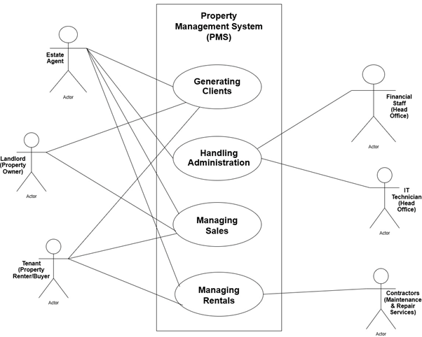
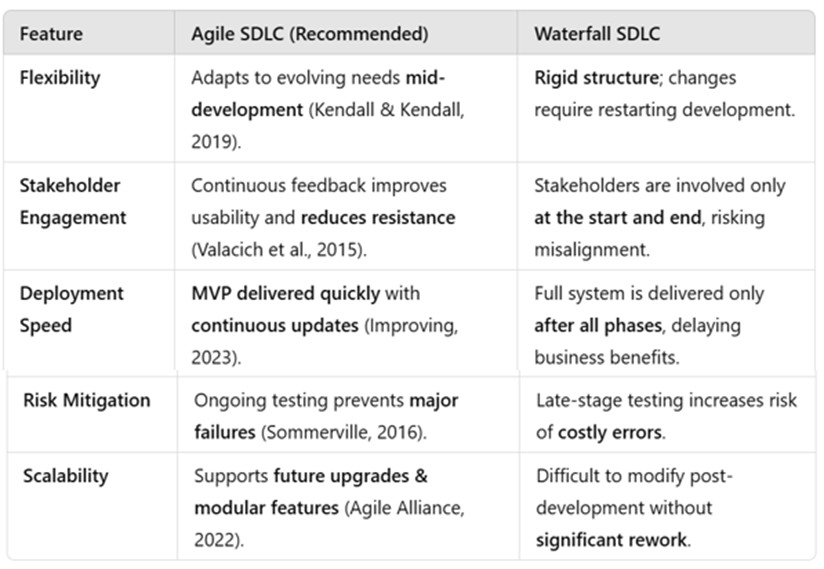
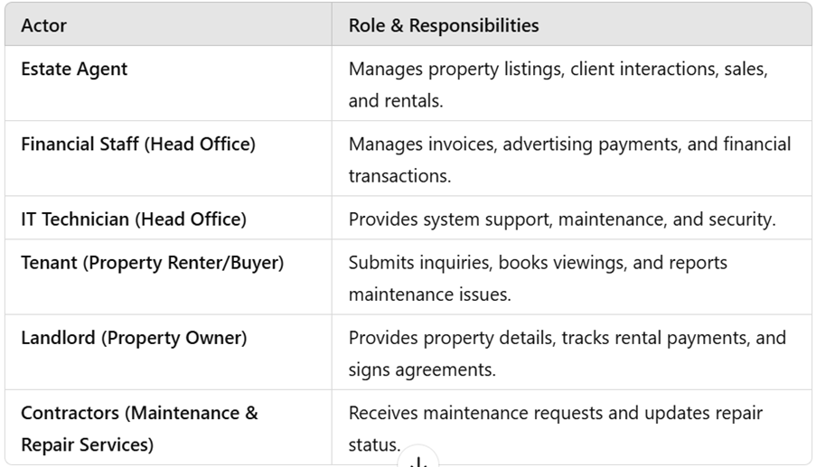
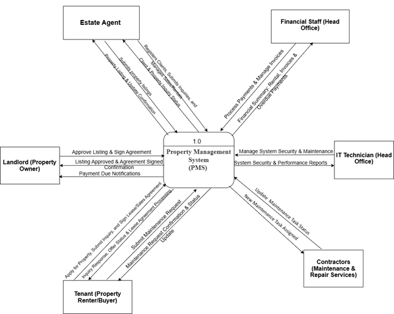
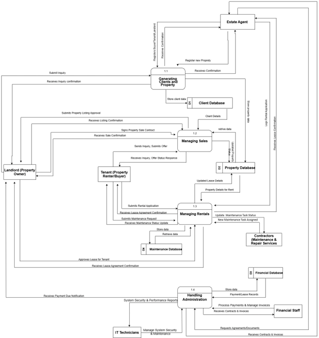
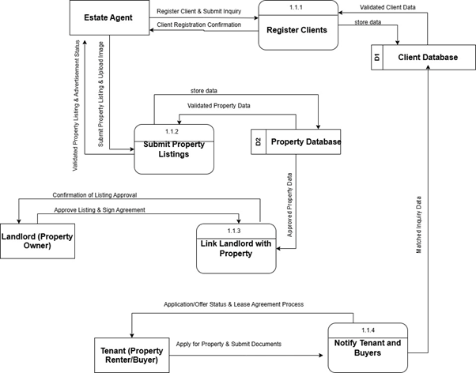
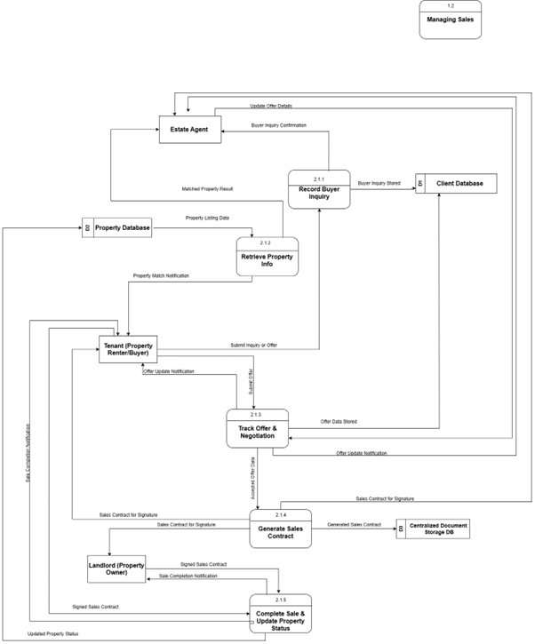
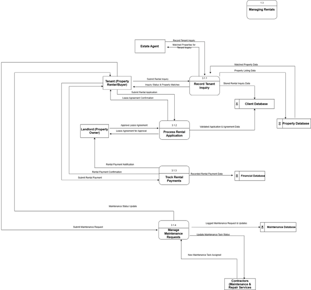
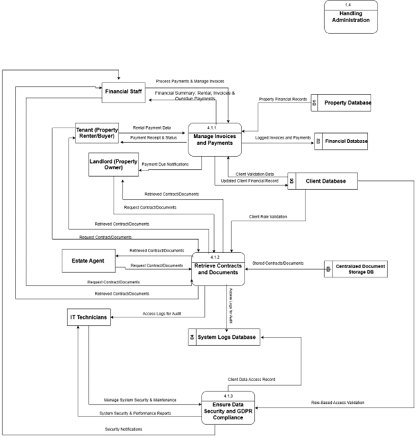
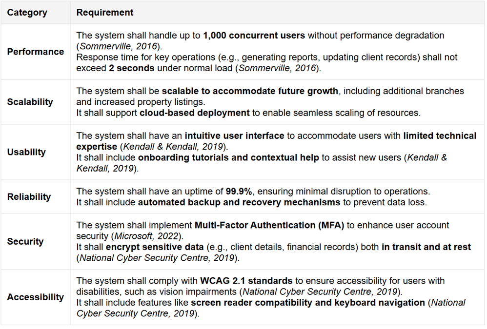

# 🏢 Prime Estates Property Management System

> **Systems Analysis & Design Case Study for a Multi-Branch Estate Agency**


---

## 📋 Project Overview

Prime Estates is a fictional multi-branch estate agency operating across the Midlands. This project was developed as part of a Systems Analysis and Design module within the BSc (Hons) Computing programme.

The objective was to analyse existing business processes, identify operational challenges, gather stakeholder requirements, and design a centralised Property Management System capable of improving efficiency across multiple branches.

The project demonstrates practical application of:

- Systems Analysis
- Requirements Engineering
- Stakeholder Analysis
- Business Process Modelling
- Agile Planning
- Use Case Modelling
- Data Flow Diagram (DFD) Development
- Non-Functional Requirements Specification

---
### Use Case Diagram



---

## 🎯 Project Objectives

The proposed system was designed to:

- Centralise property management operations
- Improve communication between branches
- Streamline sales and rental processes
- Reduce duplicated administrative work
- Improve reporting and information accuracy
- Support future business growth

---

## 🔍 Key Analysis Activities

### Stakeholder Analysis

Identification and analysis of:

- Branch Managers
- Estate Agents
- Administrative Staff
- Property Owners
- Buyers
- Tenants

---

### Requirements Engineering

The project defined:

- Functional Requirements
- Non-Functional Requirements
- Security Requirements
- Performance Requirements
- Usability Requirements

---

### Agile Methodology Selection

The project evaluated both Agile and Waterfall approaches before selecting Agile as the preferred methodology for the proposed implementation.

---

### Process Modelling

The business processes were analysed using:

- Context Diagrams
- Level 1 Data Flow Diagrams
- Level 2 Data Flow Diagrams
- Process Decomposition

---

## 📊 Project Evidence

### Agile vs Waterfall Comparison



---

### Stakeholder Roles



---

### Context Diagram



---

### Level 1 Data Flow Diagram



---

### Level 2 DFD – Client Listings



---

### Level 2 DFD – Sales Management



---

### Level 2 DFD – Rental Management



---

### Level 2 DFD – Administration



---

### Non-Functional Requirements



---

## 🛠 Techniques Demonstrated

✔ Requirements Engineering
✔ Stakeholder Analysis
✔ Agile Methodology Selection
✔ Business Process Modelling
✔ Use Case Modelling
✔ Context Diagram Design
✔ Data Flow Diagram Development
✔ Non-Functional Requirements Specification
✔ Systems Documentation

---

## 📂 Repository Structure

```text
prime-estates-property-management-system
│
├── README.md
├── LICENSE
│
├── assets
│   ├── actors-roles.png
│   ├── agile-vs-waterfall.png
│   ├── context-diagram.png
│   ├── level1-dfd.png
│   ├── level2-administration.png
│   ├── level2-clients-listings.png
│   ├── level2-rentals.png
│   ├── level2-sales.png
│   ├── non-functional-requirements.png
│   └── use-case-diagram.png
│
└── documentation
    └── prime-estates-system-analysis-report.docx
```

---

## 🎓 Learning Outcomes Demonstrated

This project demonstrates practical understanding of:

- Systems Analysis & Design
- Business Analysis
- Requirements Engineering
- Stakeholder Management
- Agile Methodologies
- Process Modelling
- Solution Design Documentation

---

## 👩‍💻 Author

**Inna Bains**

BSc (Hons) Computing Graduate

### Portfolio

- Portfolio Website: https://innabains.github.io/professional-portfolio/

### Connect

- LinkedIn: https://www.linkedin.com/in/inna-bains-0aa890264
- GitHub: https://github.com/InnaBains

---

## 📄 License

This repository is provided for educational and portfolio purposes.
